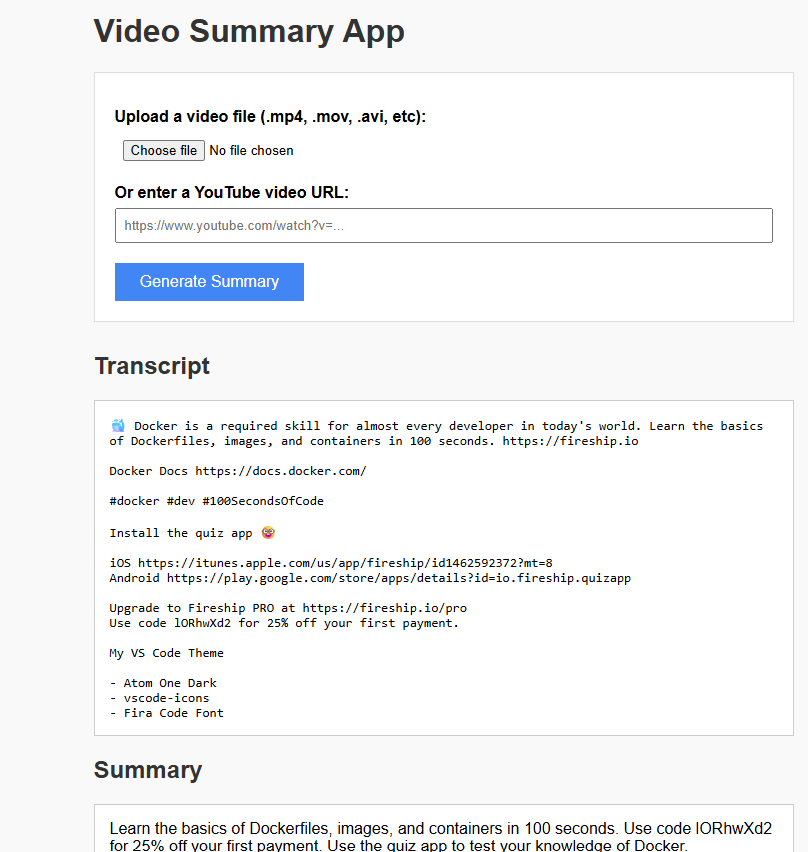

# 🎬 Video Summary App

A Flask web application that allows you to:

- 📤 Upload a video file (e.g., `.mp4`, `.avi`, `.mov`)
- 🌐 Or provide a YouTube video URL
- 🎧 Extract audio
- 🧠 Transcribe the audio using Facebook's `wav2vec2-base-960h`
- ✍️ Generate a summary using Facebook's `bart-large-cnn`

---

## 🧠 Features

- Upload video files or enter YouTube URLs
- Automatically extract and convert audio
- Transcribe spoken content using Hugging Face's `Wav2Vec2`
- Summarize long transcripts with `BART`
- Clean, simple web UI built with Flask

---

## 🚀 Demo Screenshot

 <!-- Add your own screenshot if available -->

---

## 🛠️ Installation

### 1. Clone the Repository

```bash
git clone https://github.com/yourusername/video-summary-app.git
cd video-summary-app
2. Create a Virtual Environment (Optional)
bash
Copy code
python -m venv venv
source venv/bin/activate       # macOS/Linux
venv\Scripts\activate          # Windows
3. Install Requirements
bash
Copy code
pip install -r requirements.txt
🏁 Run the App
bash
Copy code
python app.py
Open your browser and go to:
📍 http://127.0.0.1:5000/

📁 File Structure
bash
Copy code
video-summary-app/
│
├── app.py                      # Main Flask application
├── requirements.txt            # Python dependencies
├── README.md                   # Project documentation
│
├── uploads/                    # Uploaded video files (auto-created)
├── temp/                       # Temporary audio files (auto-created)
│
├── templates/
│   └── index.html              # Frontend HTML (Flask Jinja2 template)
│
├── static/
│   └── demo_screenshot.png     # Optional: UI screenshot or CSS
📦 Dependencies
nginx
Copy code
flask
torch
transformers
librosa
moviepy
yt-dlp
werkzeug
numpy
soundfile
huggingface-hub
Install with:

bash
Copy code
pip install -r requirements.txt
📌 Notes
YouTube summaries are based on descriptions, not audio transcription.

For best results, upload videos with clear speech.

GPU is used automatically if available.

🤝 License
MIT License — free to use, modify, and distribute.

💬 Acknowledgements
Hugging Face 🤗 Transformers

Facebook AI Research

yt-dlp

Librosa

MoviePy

